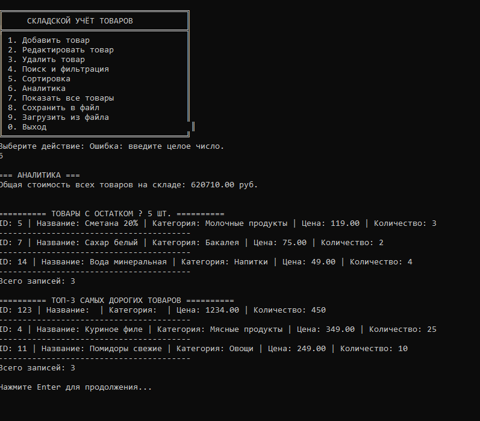

# Система складского учёта товаров (WarehouseApp)

**Выполнил:** Волков Никита Михайлович  
**Группа:** 9ис-345 
**Стиль кода:** Google C++ Style Guide

---

## 1. Цель работы

Закрепить навыки объектно-ориентированного программирования, работы со стандартной библиотекой STL, файлового ввода-вывода, проектирования модульных приложений и обработки пользовательского ввода в среде C++.

## 2. Задача

Разработать консольное приложение для автоматизации учёта товаров на складе. Программа обеспечивает:

- Добавление, редактирование, удаление записей (CRUD)
- Поиск и фильтрацию по различным критериям
- Сортировку по цене, количеству, названию
- Расчёт аналитических показателей
- Сохранение и загрузку данных в текстовом формате TXT

## 3. Технические требования

- **Язык программирования:** C++17
- **Компилятор:** Любой (MSVC, MinGW, GCC, Clang)
- **Хранение данных в памяти:** `std::vector`
- **Формат файла данных:** TXT с разделителем-запятой (CSV)
- **Обработка ошибок ввода:** Без аварийного завершения программы
- **ОС:** Windows (корректное отображение кириллицы через `SetConsoleOutputCP(CP_UTF8)`)

## 4. Функциональные возможности

### 4.1. Управление данными (CRUD)
- Добавление товара с уникальным идентификатором
- Редактирование существующей записи
- Удаление товара по ID или названию
- Валидация: цена ≥ 0, количество ≥ 0, непустые строки, уникальный ID

### 4.2. Поиск и фильтрация
- По названию (частичное совпадение, регистронезависимо)
- По категории
- По диапазону цен (от–до)

### 4.3. Сортировка
- По цене (возрастание/убывание)
- По количеству на складе
- По алфавиту (название)

### 4.4. Аналитика
- Общая стоимость всех товаров на складе
- Вывод списка товаров с остатком ≤ 5 шт.
- Топ-3 самых дорогих позиции

### 4.5. Работа с файлами
- Автоматическая загрузка `data/products.txt` при старте
- Ручное сохранение изменений по команде пользователя
- Формат строки: `id,name,category,price,quantity`

## 5. Инструкция по установке

### Требования
- Компилятор с поддержкой C++17 (MSVC, MinGW, GCC, Clang)
- CMake 3.10+ (опционально)

### Сборка с помощью CMake

```bash
# Клонирование репозитория
git clone https://github.com/nikitavolkeasycode-prog/Warehouse.git
cd Warehouse

# Создание папки сборки
mkdir build
cd build

# Генерация Makefile/проекта
cmake ..

# Сборка
cmake --build .

# Запуск
.\WarehouseApp.exe
```

### Сборка в Visual Studio
1. Откройте папку проекта в Visual Studio
2. Visual Studio автоматически обнаружит CMakeLists.txt
3. Выберите конфигурацию Release/Debug
4. Нажмите `Ctrl+F5` для сборки и запуска

### Сборка с помощью MinGW/g++

```bash
g++ -std=c++17 -o WarehouseApp.exe src/main.cpp src/Product.cpp src/Warehouse.cpp src/FileIO.cpp src/Menu.cpp -I src
.\WarehouseApp.exe
```

## 6. Структура проекта

```
WarehouseApp/
├── data/
│   └── products.txt          # Файл с данными товаров
├── src/
│   ├── main.cpp              # Точка входа в программу
│   ├── Product.h             # Заголовочный файл класса Product
│   ├── Product.cpp           # Реализация класса Product
│   ├── Warehouse.h           # Заголовочный файл класса Warehouse
│   ├── Warehouse.cpp         # Реализация класса Warehouse
│   ├── FileIO.h              # Заголовочный файл класса FileIO
│   ├── FileIO.cpp            # Реализация класса FileIO
│   ├── Menu.h                # Заголовочный файл класса Menu
│   └── Menu.cpp              # Реализация класса Menu
├── screenshots/              # Скриншоты работы программы
├── CMakeLists.txt            # Файл сборки CMake
└── README.md                 # Отчёт по проделанной работе (данный файл)
```

## 7. Описание классов

### Product
Класс, представляющий товар на складе.
- **Поля:** id, name, category, price, quantity
- **Методы:** геттеры/сеттеры, `toFileString()` (сериализация), `fromFileString()` (десериализация), перегруженный `operator<<`

### Warehouse
Класс-контейнер для хранения и управления товарами.
- **Хранение:** `std::vector<Product>`
- **CRUD:** addProduct, editProduct, removeById, removeByName
- **Поиск:** searchByName, searchByCategory, searchByPriceRange
- **Сортировка:** sortByPrice, sortByQuantity, sortByName
- **Аналитика:** getTotalValue, getLowStockItems, getTopExpensive

### FileIO
Класс для работы с файловым вводом-выводом.
- **Методы:** load (загрузка из файла), save (сохранение в файл)

### Menu
Класс, реализующий консольный интерфейс пользователя.
- Циклическое текстовое меню с навигацией
- Обработка пользовательского ввода с валидацией
- Корректное отображение кириллицы (UTF-8)

## 8. Скриншоты работы




> **Примечание:** Скриншоты находятся в папке `screenshots/` репозитория.

## 9. Поддержка кириллицы (UTF-8)

Приложение полностью поддерживает ввод и вывод русского текста в консоли Windows. Это реализовано в `Menu.h` в виде inline-функции `enableUtf8Locale()`, которая:

1. Переключает кодовую страницу консоли на UTF-8 (`SetConsoleOutputCP(CP_UTF8)` / `SetConsoleCP(CP_UTF8)`).
2. Перебирает несколько имён локали для `setlocale`: `".UTF8"` (MSVC), `"en_US.UTF-8"` / `"ru_RU.UTF-8"` (MinGW), `""` (системная).
3. Делает то же самое для `std::locale::global`, чтобы и `std::cin`/`std::cout` работали в UTF-8.
4. Ловит `std::exception` на каждом шаге — одна упавшая локаль не крашит программу.

Поиск по русским названиям регистронезависим: в `Warehouse.cpp` используется `utf8ToLower()`, который корректно переводит кириллицу в нижний регистр через WinAPI (`MultiByteToWideChar` + `CharLowerBuffW`).

`FileIO::load` снимает UTF-8 BOM (`EF BB BF`) в начале файла, если файл был сохранён в Блокноте Windows — иначе первая строка ломала парсинг.

> **Важно:** в свойствах консоли Windows должен быть установлен шрифт **Consolas** или **Lucida Console** (они поддерживают кириллицу в UTF-8). Шрифт `Raster Fonts` не подходит.

## 10. История изменений

| Коммит    | Описание                                                              |
|-----------|-----------------------------------------------------------------------|
| `d7f09ec` | **Fix UTF-8 Cyrillic output** — кросс-компиляторная инициализация локали, защита от BOM в `FileIO::load` |
| `e11ed05` | **Add application screenshots** — добавлены 4 скриншота работы программы в `screenshots/` |
| `08c9efc` | Базовая версия проекта                                               |

## 11. Комментарии по проекту

### С какими трудностями столкнулся:
- Корректное отображение кириллицы в консоли Windows потребовало использования `SetConsoleOutputCP(CP_UTF8)` и правильного размещения `#define NOMINMAX` перед `#include <Windows.h>` для избежания конфликта с макросами min/max
- В MinGW-сборке `std::locale(".UTF8")` бросает исключение, поэтому пришлось сделать fallback на `std::locale("")` и другие UTF-8 локали
- Обработка ошибок ввода пользователя (некорректные типы данных) потребовала реализации устойчивых функций ввода с циклом повторения
- При разработке сортировки пришлось учитывать, что `std::sort` требует строгого слабого порядка (strict weak ordering)

### Что оказалось лёгким:
- Базовая структура классов и CRUD-операции
- Работа с `std::vector` и алгоритмами STL
- Сериализация/десериализация данных в CSV-формат

### Какие моменты были непонятны:
- На начальном этапе было не до конца ясно, как правильно организовать обработку ошибок парсинга файла, чтобы программа не завершалась аварийно при наличии некорректных строк в данных

### Общие впечатления:
Проект помог закрепить на практике принципы ООП, работу с STL, файловый ввод-вывод и обработку пользовательского ввода. В целом, задача оказалась интересной и полезной для понимания архитектуры консольных приложений на C++.